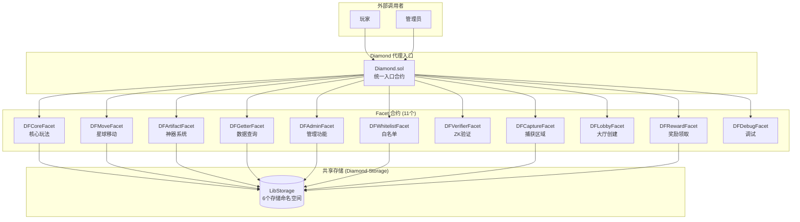

# Dark Forest 智能合约架构分析

## 1. 整体架构概览

Dark Forest 采用 **Diamond 模式 (EIP-2535)** 实现合约架构，这是一种可升级的多面合约模式。



---

## 2. 存储结构 (Diamond Storage)

所有 Facet 共享同一份存储，通过 `LibStorage.sol` 定义的 6 个存储命名空间访问：

### 2.1 GameStorage (游戏运行时状态)

| 字段                       | 类型                                      | 说明                   |
| -------------------------- | ----------------------------------------- | ---------------------- |
| `diamondAddress`           | address                                   | Diamond 合约地址       |
| `paused`                   | bool                                      | 游戏暂停状态           |
| `TOKEN_MINT_END_TIMESTAMP` | uint256                                   | 游戏结束时间戳         |
| `planetIds`                | uint256[]                                 | 所有已初始化星球ID列表 |
| `revealedPlanetIds`        | uint256[]                                 | 已揭示坐标的星球ID列表 |
| `playerIds`                | address[]                                 | 所有玩家地址列表       |
| `worldRadius`              | uint256                                   | 当前宇宙半径           |
| `planets`                  | mapping(uint256 => Planet)                | 星球数据               |
| `players`                  | mapping(address => Player)                | 玩家数据               |
| `revealedCoords`           | mapping(uint256 => RevealedCoords)        | 已揭示坐标             |
| `planetEvents`             | mapping(uint256 => PlanetEventMetadata[]) | 星球事件队列           |
| `planetArrivals`           | mapping(uint256 => ArrivalData)           | 到达数据               |
| `planetArtifacts`          | mapping(uint256 => uint256[])             | 星球上的神器ID列表     |
| `artifacts`                | mapping(uint256 => Artifact)              | 神器数据               |

### 2.2 WhitelistStorage (白名单)

| 字段                  | 类型                     | 说明                 |
| --------------------- | ------------------------ | -------------------- |
| `enabled`             | bool                     | 白名单是否启用       |
| `drip`                | uint256                  | 新玩家领取的初始资金 |
| `allowedAccounts`     | mapping(address => bool) | 白名单账户           |
| `newAllowedKeyHashes` | mapping(uint256 => bool) | 有效的邀请码哈希     |

### 2.3 GameConstants (游戏配置常量)

| 字段                       | 类型    | 说明             |
| -------------------------- | ------- | ---------------- |
| `WORLD_RADIUS_MIN`         | uint256 | 最小宇宙半径     |
| `MAX_NATURAL_PLANET_LEVEL` | uint256 | 最大自然星球等级 |
| `TIME_FACTOR_HUNDREDTHS`   | uint256 | 时间加速因子     |
| `PERLIN_THRESHOLD_1/2/3`   | uint256 | 空间类型阈值     |
| `PLANET_RARITY`            | uint256 | 星球稀有度       |
| `LOCATION_REVEAL_COOLDOWN` | uint256 | 揭示坐标冷却时间 |

### 2.4 SnarkConstants (ZK证明配置)

| 字段                | 类型    | 说明               |
| ------------------- | ------- | ------------------ |
| `DISABLE_ZK_CHECKS` | bool    | 是否跳过ZK验证     |
| `PLANETHASH_KEY`    | uint256 | 星球哈希MiMC密钥   |
| `SPACETYPE_KEY`     | uint256 | 空间类型Perlin密钥 |
| `BIOMEBASE_KEY`     | uint256 | 生物群落Perlin密钥 |

---

## 3. Facet 合约详解

### 3.1 DFCoreFacet - 核心游戏逻辑

| 接口                                 | 权限   | ZK证明    | 说明         |
| ------------------------------------ | ------ | --------- | ------------ |
| `initializePlayer(_a,_b,_c,_input)`  | 白名单 | ✅ Init   | 玩家初始化   |
| `revealLocation(_a,_b,_c,_input)`    | 白名单 | ✅ Reveal | 揭示星球坐标 |
| `upgradePlanet(location, branch)`    | 玩家   | ❌        | 升级星球     |
| `transferPlanet(location, player)`   | 玩家   | ❌        | 转让星球     |
| `withdrawSilver(locationId, amount)` | 玩家   | ❌        | 提取银矿     |

### 3.2 DFMoveFacet - 星球移动

| 接口                                                | 权限 | ZK证明  | 说明          |
| --------------------------------------------------- | ---- | ------- | ------------- |
| `move(_a,_b,_c,_input,pop,silver,artifact,abandon)` | 玩家 | ✅ Move | 星球移动/攻击 |

### 3.3 DFArtifactFacet - 神器系统 (ERC721)

| 接口                                       | 权限   | ZK证明       | 说明       |
| ------------------------------------------ | ------ | ------------ | ---------- |
| `findArtifact(_a,_b,_c,_input)`            | 玩家   | ✅ Biomebase | 挖掘神器   |
| `prospectPlanet(locationId)`               | 玩家   | ❌           | 标记可挖掘 |
| `depositArtifact(locationId, artifactId)`  | 玩家   | ❌           | 放置神器   |
| `withdrawArtifact(locationId, artifactId)` | 玩家   | ❌           | 取回神器   |
| `activateArtifact(...)`                    | 玩家   | ❌           | 激活神器   |
| `giveSpaceShips(locationId)`               | 白名单 | ❌           | 领取飞船   |

### 3.4 DFVerifierFacet - ZK验证器

| 接口                                       | 说明             |
| ------------------------------------------ | ---------------- |
| `verifyInitProof(_a,_b,_c,_input[8])`      | 验证初始化证明   |
| `verifyMoveProof(_a,_b,_c,_input[10])`     | 验证移动证明     |
| `verifyRevealProof(_a,_b,_c,_input[9])`    | 验证揭示证明     |
| `verifyBiomebaseProof(_a,_b,_c,_input[7])` | 验证生物群落证明 |
| `verifyWhitelistProof(_a,_b,_c,_input[2])` | 验证白名单证明   |

### 3.5 DFAdminFacet - 管理员功能

| 接口                           | 说明           |
| ------------------------------ | -------------- |
| `pause()` / `unpause()`        | 暂停/恢复游戏  |
| `setOwner(planetId, newOwner)` | 设置星球所有者 |
| `createPlanet(args)`           | 创建星球       |
| `withdraw()`                   | 提取合约余额   |

---

## 4. 核心数据类型

### Planet (星球)

```solidity
struct Planet {
    address owner;           // 所有者
    uint256 range;           // 射程
    uint256 speed;           // 速度
    uint256 defense;         // 防御
    uint256 population;      // 当前能量
    uint256 populationCap;   // 能量上限
    uint256 silver;          // 当前银矿
    uint256 planetLevel;     // 星球等级 (0-9)
    PlanetType planetType;   // 类型
    SpaceType spaceType;     // 空间类型
    uint256 perlin;          // perlin值
    bool isHomePlanet;       // 是否是出生点
    bool destroyed;          // 是否被摧毁
}
```

### Player (玩家)

```solidity
struct Player {
    bool isInitialized;      // 是否已初始化
    address player;          // 地址
    uint256 homePlanetId;    // 出生点ID
    uint256 lastRevealTimestamp; // 上次揭示时间
    uint256 score;           // 积分
    uint256 spaceJunk;       // 太空垃圾
}
```

### Artifact (神器)

```solidity
struct Artifact {
    uint256 id;              // NFT ID
    uint256 planetDiscoveredOn; // 发现星球
    ArtifactRarity rarity;   // 稀有度
    ArtifactType artifactType; // 类型
    uint256 wormholeTo;      // 虫洞目标
    address controller;      // 控制者
}
```

---

## 5. 需要 ZK 证明的接口汇总

| 接口               | 调用的验证函数         | 电路             |
| ------------------ | ---------------------- | ---------------- |
| `initializePlayer` | `verifyInitProof`      | init.circom      |
| `move`             | `verifyMoveProof`      | move.circom      |
| `revealLocation`   | `verifyRevealProof`    | reveal.circom    |
| `invadePlanet`     | `verifyRevealProof`    | reveal.circom    |
| `findArtifact`     | `verifyBiomebaseProof` | biomebase.circom |
| `useKey`           | `verifyWhitelistProof` | whitelist.circom |
