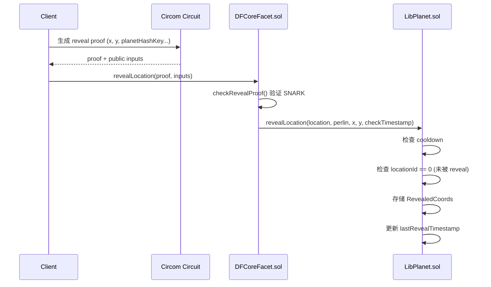
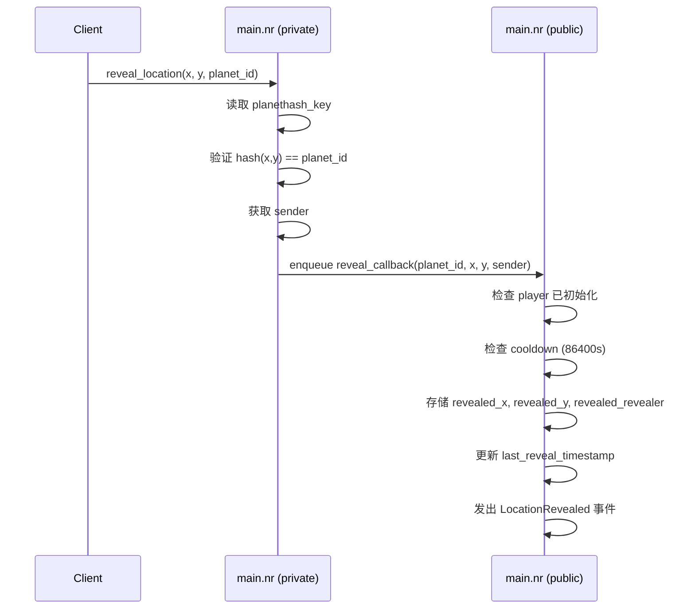

# Reveal Location 逻辑对比分析

## 概述

本文档对比 `reveal_location` 操作在两套实现中的逻辑：

| 架构                         | 私有层 (ZK Proof)                                 | 公共层 (State)                           |
| ---------------------------- | ------------------------------------------------- | ---------------------------------------- |
| **原版 (Circom + Solidity)** | `circuits/reveal/circuit.circom` 生成 SNARK proof | `DFCoreFacet.sol` → `LibPlanet.sol`      |
| **Aztec 版 (Noir)**          | `main.nr::reveal_location()` (private fn)         | `main.nr::reveal_callback()` (public fn) |

---

## 1. 调用流程对比

### 原版流程 (Circom + Solidity)



### Aztec 版流程 (Noir)



---

## 2. 私有层逻辑对比 (ZK Proof)

### Circom 电路 (`circuits/reveal/circuit.circom`)

```circom
template Reveal() {
    // Public signals (全部公开!)
    signal input x;
    signal input y;
    signal input PLANETHASH_KEY;
    signal input SPACETYPE_KEY;
    signal input SCALE;
    signal input xMirror;
    signal input yMirror;

    signal output pub;    // MiMC(x, y) = planet_id
    signal output perl;   // perlin(x, y) = perlin value

    // 1. 范围检查: |x|, |y| <= 2^31
    component n2bx = Num2Bits(32);
    n2bx.in <== x + (1 << 31);
    component n2by = Num2Bits(32);
    n2by.in <== y + (1 << 31);

    // 2. 计算 planet hash
    component mimc = MiMCSponge(2, 220, 1);
    mimc.ins[0] <== x;
    mimc.ins[1] <== y;
    mimc.k <== PLANETHASH_KEY;
    pub <== mimc.outs[0];

    // 3. 计算 perlin (spacetype)
    component perlin = MultiScalePerlin();
    perlin.p[0] <== x;
    perlin.p[1] <== y;
    perlin.KEY <== SPACETYPE_KEY;
    perlin.SCALE <== SCALE;
    perlin.xMirror <== xMirror;
    perlin.yMirror <== yMirror;
    perl <== perlin.out;
}

// 注意: x, y 是 PUBLIC 的!
component main { public [ x, y, PLANETHASH_KEY, SPACETYPE_KEY, SCALE, xMirror, yMirror ] } = Reveal();
```

> [!IMPORTANT]
> **关键差异**: Circom 的 reveal 电路中 `x, y` 是 **PUBLIC** 信号! 这是因为这是"揭示"操作——目的就是公开地告诉链上你的坐标。

### Noir 私有函数 (`main.nr::reveal_location`)

```rust
#[external("private")]
fn reveal_location(
    x: Field,        // 私有输入
    y: Field,        // 私有输入
    planet_id: Field,
) {
    // 读取配置
    let planethash_key = self.storage.planethash_key.read();

    // 1. 验证坐标哈希
    let computed = compute_planet_hash(x, y, planethash_key);
    assert(computed == planet_id, "Invalid coordinates");

    // 2. 获取发送者
    let sender = self.context.msg_sender().unwrap();

    // 3. 将 x, y 传递给 public callback (会变成公开的!)
    self.enqueue_self.reveal_callback(planet_id, x, y, sender);
}
```

### 私有层对比表

| 检查项                              | Circom                | Noir                     | 差异            |
| ----------------------------------- | --------------------- | ------------------------ | --------------- |
| 坐标范围检查 `\|x\|, \|y\| <= 2^31` | ✅ `Num2Bits(32)`     | ❌ **缺失**              | 🔴 **需要添加** |
| 计算 planet hash                    | ✅ `MiMCSponge`       | ✅ `compute_planet_hash` | ✅ 一致         |
| 验证 hash == planet_id              | ✅ 隐式 (output)      | ✅ 显式 assert           | ✅ 一致         |
| 计算 perlin                         | ✅ `MultiScalePerlin` | ❌ **缺失**              | ⚠️ **需要确认** |
| 输出 perlin                         | ✅ `perl` output      | ❌ (不需要)              | ✅ (见下文)     |

> [!NOTE]
> Circom 输出 perlin 值是因为 Solidity 需要它来初始化未知星球。但在 Noir 版本中，如果星球未初始化，reveal 操作可能需要额外逻辑。

---

## 3. 公共层逻辑对比 (State Management)

### Solidity (`DFCoreFacet.sol` + `LibPlanet.sol`)

**DFCoreFacet.sol::revealLocation**:

```solidity
function revealLocation(
    uint256[2] memory _a,
    uint256[2][2] memory _b,
    uint256[2] memory _c,
    uint256[9] memory _input  // [0]=location, [1]=perlin, [2]=x, [3]=y, [4-8]=perlin flags
) public onlyWhitelisted returns (uint256) {
    // 1. 验证 SNARK proof
    require(checkRevealProof(_a, _b, _c, _input), "Failed reveal pf check");

    // 2. 如果星球未初始化，先初始化它
    if (!gs().planets[_input[0]].isInitialized) {
        LibPlanet.initializePlanetWithDefaults(_input[0], _input[1], false);
    }

    // 3. 调用 LibPlanet 处理 reveal
    LibPlanet.revealLocation(
        _input[0],  // location
        _input[1],  // perlin
        _input[2],  // x
        _input[3],  // y
        msg.sender != LibDiamond.contractOwner()  // checkTimestamp (admin 可跳过)
    );

    emit LocationRevealed(msg.sender, _input[0], _input[2], _input[3]);
}
```

**LibPlanet.sol::revealLocation**:

```solidity
function revealLocation(
    uint256 location,
    uint256 perlin,    // ← 没有使用!
    uint256 x,
    uint256 y,
    bool checkTimestamp
) public {
    // 1. Cooldown 检查 (非 admin)
    if (checkTimestamp) {
        require(
            block.timestamp - gs().players[msg.sender].lastRevealTimestamp >
                gameConstants().LOCATION_REVEAL_COOLDOWN,
            "wait for cooldown before revealing again"
        );
    }

    // 2. 检查未被 reveal 过
    require(gs().revealedCoords[location].locationId == 0, "Location already revealed");

    // 3. 存储数据
    gs().revealedPlanetIds.push(location);
    gs().revealedCoords[location] = RevealedCoords({
        locationId: location,
        x: x,
        y: y,
        revealer: msg.sender
    });

    // 4. 更新 cooldown
    gs().players[msg.sender].lastRevealTimestamp = block.timestamp;
}
```

### Noir (`main.nr::reveal_callback`)

```rust
#[external("public")]
#[only_self]
fn reveal_callback(
    planet_id: Field,
    x: Field,
    y: Field,
    sender: AztecAddress
) {
    // 1. 检查 player 已初始化
    let mut player = self.storage.players.at(sender).read();
    assert(player.is_initialized, "Player not initialized");

    // 2. Cooldown 检查 (24 hours = 86400 seconds)
    let last_reveal = player.last_reveal_timestamp;
    let current_time = self.context.timestamp();
    if last_reveal != 0 {
        assert(current_time >= last_reveal + 86400, "Reveal cooldown active");
    }

    // 3. 存储 revealed 数据 (分开存储)
    self.storage.revealed_x.at(planet_id).write(x);
    self.storage.revealed_y.at(planet_id).write(y);
    self.storage.revealed_revealer.at(planet_id).write(sender);

    // 4. 更新 player cooldown
    player.last_reveal_timestamp = current_time;
    self.storage.players.at(sender).write(player);

    // 5. 发出事件
    self.context.emit_public_log(
        LocationRevealed {
            planet_id: planet_id,
            x: x,
            y: y,
            revealer: sender,
        }
    );
}
```

### 公共层对比表

| 检查项                   | Solidity                          | Noir                 | 差异            |
| ------------------------ | --------------------------------- | -------------------- | --------------- |
| 白名单检查               | ✅ `onlyWhitelisted`              | ❌ 缺失              | ⚠️ **考虑添加** |
| 验证 ZK proof            | ✅ `checkRevealProof`             | ✅ 隐式 (private fn) | ✅ 一致         |
| 检查 player 已初始化     | ❌ (隐式)                         | ✅ 显式              | ✅ Noir 更严格  |
| Cooldown 检查            | ✅ `>` 比较                       | ⚠️ `>=` 比较         | ⚠️ **轻微差异** |
| Cooldown 值              | `LOCATION_REVEAL_COOLDOWN` (配置) | `86400` (硬编码)     | 🔴 **应配置化** |
| Admin 可跳过 cooldown    | ✅ `checkTimestamp` 参数          | ❌ 缺失              | ⚠️ **考虑添加** |
| 检查未被 reveal 过       | ✅ `locationId == 0`              | ❌ **缺失**          | 🔴 **需要添加** |
| 初始化未知星球           | ✅ `initializePlanetWithDefaults` | ❌ **缺失**          | 🔴 **需要添加** |
| 存储 revealedPlanetIds   | ✅ `push(location)`               | ❌ 缺失 (无列表)     | ⚠️ **考虑添加** |
| 存储 RevealedCoords      | ✅ 单结构体                       | ✅ 分开 3 个 Map     | ✅ 功能等价     |
| 更新 lastRevealTimestamp | ✅                                | ✅                   | ✅ 一致         |
| 发出事件                 | ✅                                | ✅                   | ✅ 一致         |

---

## 4. 关键差异总结

### 🔴 必须修复的问题

1. **坐标范围检查缺失** (Private)
   - Circom: `|x|, |y| <= 2^31`
   - Noir: 无检查
   - **影响**: 可能传入超大坐标导致计算溢出

2. **重复 reveal 检查缺失** (Public)
   - Solidity: `require(revealedCoords[location].locationId == 0)`
   - Noir: 无检查
   - **影响**: 同一星球可以被多次 reveal，后者覆盖前者

3. **未初始化星球自动初始化缺失** (Public)
   - Solidity: `if (!isInitialized) initializePlanetWithDefaults(...)`
   - Noir: 无此逻辑
   - **影响**: 无法 reveal 未被占领过的星球

4. **Cooldown 硬编码** (Public)
   - Solidity: 从 `gameConstants().LOCATION_REVEAL_COOLDOWN` 读取
   - Noir: 硬编码 `86400`
   - **影响**: 无法通过配置调整 cooldown

### ⚠️ 建议添加的功能

5. **Admin 跳过 cooldown**
   - Solidity: admin 地址可跳过 cooldown
   - Noir: 所有人都受 cooldown 限制

6. **白名单检查**
   - Solidity: `onlyWhitelisted` modifier
   - Noir: 无白名单

7. **Revealed Planet IDs 列表**
   - Solidity: 维护 `revealedPlanetIds` 数组
   - Noir: 无列表，只能通过 planet_id 查询

### ✅ 一致的部分

- Planet hash 验证
- Cooldown 更新逻辑
- 事件发出
- RevealedCoords 数据结构 (字段一致)

---

## 5. TODO 清单

| ID     | 严重性    | 位置              | 描述                                    |
| ------ | --------- | ----------------- | --------------------------------------- |
| DIFF-1 | 🔴 High   | `reveal_location` | 添加坐标范围检查 `\|x\|, \|y\| <= 2^31` |
| DIFF-2 | 🔴 High   | `reveal_callback` | 添加重复 reveal 检查                    |
| DIFF-3 | 🔴 High   | `reveal_callback` | 添加未初始化星球自动初始化              |
| DIFF-4 | ⚠️ Medium | `reveal_callback` | Cooldown 配置化                         |
| DIFF-5 | ⚠️ Medium | `reveal_callback` | Admin 跳过 cooldown                     |
| DIFF-6 | ⚠️ Low    | Storage           | 添加 `revealed_planet_ids` 列表         |
| DIFF-7 | ⚠️ Low    | `reveal_location` | 白名单检查                              |
